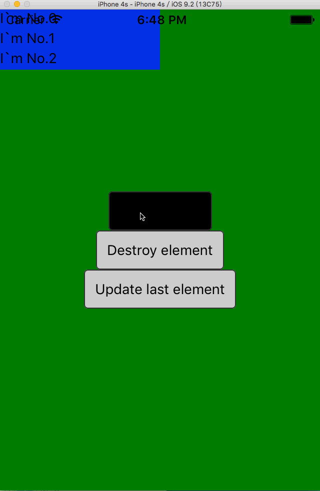

### react-native-root-siblings
---

Add sibling elements after your app root element.
The created sibling elements are above the rest of your app elements.
This can be used to create a `Modal` component or something should be over your app.

### Add it to your project

Run `npm install react-native-root-siblings --save`

### USAGE
This library can add element above the root app component registered by `AppRegistry.registerComponent`.

1. Create sibling element
```
let sibling = new RootSiblings(<View
    style={{top: 0,right: 0,bottom: 0,left: 0,backgroundColor: 'red'}}
/>);
```
This will create a View element cover all of your app elements,
and returns a sibling instance.
You can create a sibling anywhere inside your react native code.

2. Update sibling element
```
sibling.update(<View
    style={{top: 10,right: 10,bottom: 10,left: 10,backgroundColor: 'blue'}}
/>);
```
This will update the sibling instance to a View with blue backgroundColor and cover the screen by `10` offset distance.

3. Destroy sibling element
```
sibling.destroy();
```
This will remove the sibling element.

### EXAMPLE

```
'use strict';
import React, {
    AppRegistry,
    View,
    Component,
    TouchableHighlight,
    StyleSheet,
    Text
} from 'react-native';
import Dimensions from 'Dimensions';

// Import library there,it will wrap everything registered by AppRegistry.registerComponent
// And add or remove other elements after the root component
import RootSiblings from 'react-native-root-siblings';

var id = 0;
var elements = [];
class SiblingsExample extends Component{
    addSibling = () => {
        let sibling = new RootSiblings(<View
            style={[styles.sibling, {top: id * 20}]}
        >
            <Text>I`m No.{id}</Text>
        </View>);
        id++;
        elements.push(sibling);
    };

    destroySibling = () => {
        let lastSibling = elements.pop();
        lastSibling && lastSibling.destroy();
    };

    updateSibling = () => {
        let lastId = elements.length - 1;
        lastId >= 0 && elements[lastId].update(<View
            style={[styles.sibling, {top: lastId * 20}]}
        >
            <Text>I`m No.{lastId} : {Math.random()}</Text>
        </View>);
    };

    render() {
        return <View style={styles.container}>
            <TouchableHighlight
                style={styles.button}
                onPress={this.addSibling}
            >
                <Text style={styles.buttonText}>Add element</Text>
            </TouchableHighlight>
            <TouchableHighlight
                style={styles.button}
                onPress={this.destroySibling}
            >
                <Text style={styles.buttonText}>Destroy element</Text>
            </TouchableHighlight>
            <TouchableHighlight
                style={styles.button}
                onPress={this.updateSibling}
            >
                <Text style={styles.buttonText}>Update element</Text>
            </TouchableHighlight>
        </View>;
    }
}

AppRegistry.registerComponent('SiblingsExample', () => SiblingsExample);

var styles = StyleSheet.create({
    container: {
        flex: 1,
        alignItems: 'center',
        justifyContent: 'center',
        backgroundColor: 'green',
    },
    button: {
        borderRadius: 4,
        padding: 10,
        marginLeft: 10,
        marginRight: 10,
        backgroundColor: '#ccc',
        borderColor: '#333',
        borderWidth: 1,
    },
    buttonText: {
        color: '#000'
    },
    sibling: {
        left: 0,
        height: 20,
        width: Dimensions.get('window').width / 2,
        backgroundColor: 'blue',
        opacity: 0.5
    }
});

```



### RUN EXAMPLE

1. fork this repository
2. change dictionary to `Examples`
3. run `npm i`
